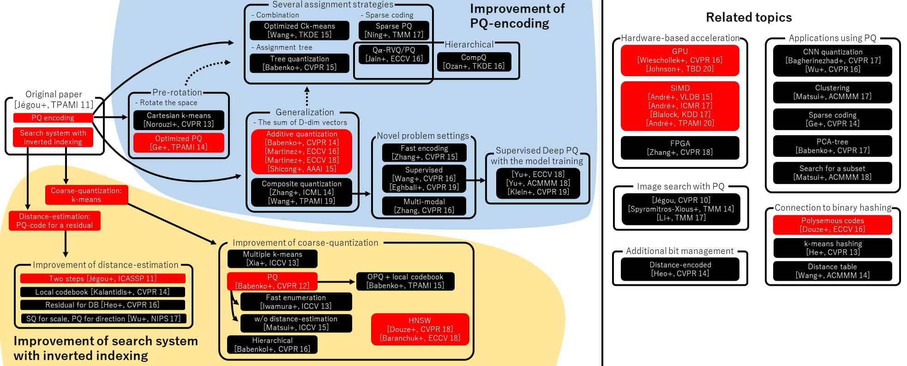
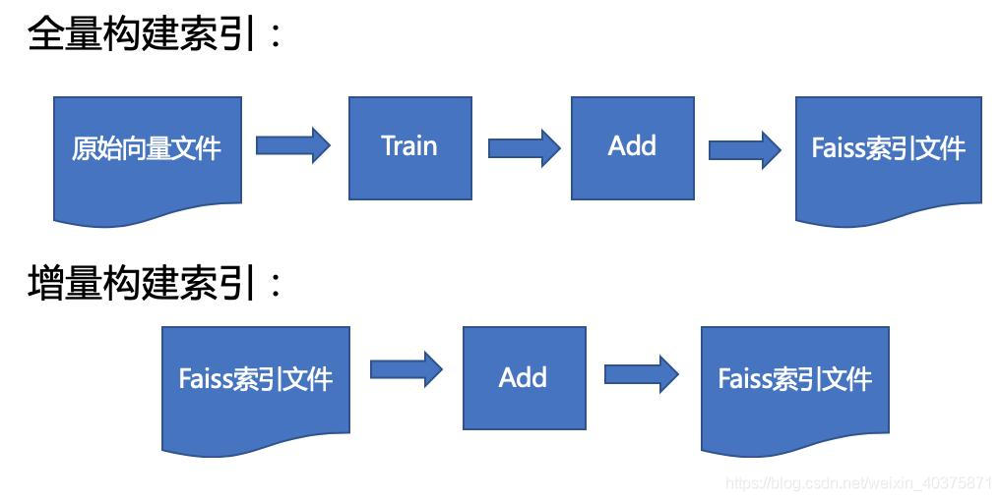

## Introduction
[Faiss](https://faiss.ai/) 是由 Facebook 开源的一款用于 ``ANN Search`` 的库，常用于大规模信息检索。其主要用到的算法如下：



### Faiss 的基础依赖
1. Faiss 与计算资源之间需要一个外部依赖框架，这个框架是一个矩阵计算框架，官方默认配置安装的是 ``OpenBlas``，另外也可以用 Intel 的 ``MKL``，相比于 ``OpenBlas`` 使用 ``MKL`` 作为框架进行编译可以提高一定的稳定性。
2. OpenMP：如果向量之间的相似性搜索是逐条进行的那计算效率会非常低，而Faiss内部实现使用了OpenMP，可以以batch的形式来进行搜素，实现计算效率的提升。

### Faiss 工作数据流
在使用 Faiss 进行 query 向量的相似性搜索之前，需要将原始的向量集构建封装成一个索引文件（index file）并缓存在内存中，提供实时的查询计算。在第一次构建索引文件的时候，需要经过 ``train`` 和 ``add`` 两个过程。后续如果有新的向量需要被添加到索引文件的话还可以有一个Add操作从而实现增量build索引。



## Details of Faiss
Faiss 本质上是一个向量（矢量）数据库。进行搜索时，基础是原始向量数据库，基本单位是单个向量，默认输入一个向量 ``x``，返回和 ``x`` 最相似的 $k$ 个向量。其中的核心就是索引（index 对象），Index 继承了一组向量库，作用是对原始向量集进行预处理和封装，一般操作包括 ``train`` (``IndexFlatL2`` 可以跳过该步骤) 和 ``add``，可以建成一个索引对象缓存在计算机内存中。所有向量在建立前需要明确向量的维度 $d$，大多数的索引还需要训练阶段来分析向量的分布（除了IndexFlatL2）。当索引被建立就可以进行后续的 ``search`` 操作了。**Faiss 只支持 32-bit floating point matrices**，会用到 ``xb`` 和 ``xq`` 两个变量，分别代表 ``database gallery`` 和 ``query``。
- ``xb`` for the database, that contains all the vectors that must be indexed, and that we are going to search in. Its size is $nb\times d$
- ``xq`` for the query vectors, for which we need to find the nearest neighbors. Its size is $nq\times d$. If we have a single query vector, $nq=1$

### train
- 目的：生成原向量中心点，残差(向量中心点的差值)向量中心点，部分预计算的距离
- 流程：
    * 把原始向量分成 $M$ 个子空间，针对每个子空间训练中心点(如果每个子空间的中心点为 $n$，则 $pq$ 可表达 $n^M$ 个中心点)
    * 查找向量对应的中心点
    * 向量减去对应的中心点生成残差向量
    * 针对残差向量生成二级量化器

## search：
``search`` 涉及实际的相似度计算，返回的检索结果包括两个矩阵，分别为 ``xq`` 中元素与近邻的距离 $D$ 和近邻向量的索引序号 $I$。

Faiss 目前支持的索引：[Faiss Basic Index](https://github.com/facebookresearch/faiss/wiki/Faiss-indexes)，常见的有下几种：
- ``IndexFlatL2``: brute force L2 distance search

    用法示例：
    ```python3
    d = 64                           # dimension
    nb = 100000                      # database size
    nq = 10000                       # nb of queries
    np.random.seed(1234)             # make reproducible
    xb = np.random.random((nb, d)).astype('float32')
    xb[:, 0] += np.arange(nb) / 1000.
    xq = np.random.random((nq, d)).astype('float32')
    xq[:, 0] += np.arange(nq) / 1000.

    quantizer = faiss.IndexFlatL2(d)
    index = faiss.IndexIVFFlat(quantizer, d, nlist, faiss.METRIC_L2)
    index.train(xb)
    index.add(xb)                 
    D, I = index.search(xq, k)   
    ```

- ``IndexIVFFlat``: segment the dataset into pieces, we define Voronoi cells in the ``d``-dimensional space, and each database vector falls in one of the cells. At search time, only the database vectors ``y`` contained in the cell the query ``x`` falls in and a few neighboring ones are compared against the query vector

    用法示例：
    ```python3
    nlist = 100
    k = 4
    quantizer = faiss.IndexFlatL2(d)  # the other index
    index = faiss.IndexIVFFlat(quantizer, d, nlist)
    assert not index.is_trained
    index.train(xb)
    assert index.is_trained

    index.add(xb)                  # add may be a bit slower as well
    D, I = index.search(xq, k)     # actual search
    print(I[-5:])                  # neighbors of the 5 last queries
    index.nprobe = 10              # default nprobe is 1, try a few more
    D, I = index.search(xq, k)
    print(I[-5:])                  # neighbors of the 5 last queries
    ```

- ``IndexIVFPQ``: ``IndexFlatL2`` and ``IndexIVFFlat`` both store the full vectors. To scale up to very large datasets, Faiss offers variants that compress the stored vectors with a lossy compression based on [product quantizers](https://hal.inria.fr/file/index/docid/514462/filename/paper_hal.pdf). The vectors are still stored in Voronoi cells, but their size is reduced to a configurable number of bytes ``m`` (``d`` must be a multiple of ``m``)

    用法示例：
    ```python3
    nlist = 100
    m = 8                             # number of subquantizers
    k = 4
    quantizer = faiss.IndexFlatL2(d)  # this remains the same
    index = faiss.IndexIVFPQ(quantizer, d, nlist, m, 8)
                                        # 8 specifies that each sub-vector is encoded as 8 bits
    index.train(xb)
    index.add(xb)
    D, I = index.search(xb[:5], k) # sanity check
    print(I)
    print(D)
    index.nprobe = 10              # make comparable with experiment above
    D, I = index.search(xq, k)     # search
    print(I[-5:])
    ```

    Replace ``PQ8`` with ``Flat`` to get an ``IndexFlat``. The factory is particularly useful when preprocessing (PCA) is applied to the input vectors. For example, the factory string to preprocess reduce the vectors to 32D by PCA projection is: ``"PCA32,IVF100,Flat"``.
    ```python3
    index = faiss.index_factory(d, "IVF100,PQ8")
    ```


## References
1. [Faiss wiki](https://github.com/facebookresearch/faiss/wiki)
2. [faiss原理（Product Quantization）](https://zhuanlan.zhihu.com/p/534004381)
3. [算法工程-Faiss原理和使用总结](https://blog.csdn.net/weixin_40375871/article/details/119119975)
4. [Faiss Indexes](https://github.com/facebookresearch/faiss/wiki/Faiss-indexes)